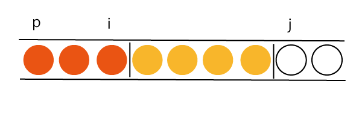

# 高等的整列

---
## 内容

- マージソート
- パーティション
- クイックソート
- 計数ソート
- 反転数
- 最小コストソート

---
## マージソート

[Recursion / Divide and Conquer - Merge Sort](http://judge.u-aizu.ac.jp/onlinejudge/description.jsp?id=ALDS1_5_B&lang=jp)

---
### マージソートの特徴

- 分割統治法に基づく高速なソート
- 安定
- 入力配列とは別にメモリを使う(**O(n)**)

---
### アルゴリズム

- 配列を真ん中で2分割する (Divide)
- それぞれの配列をsortする (Solve)
- ソートされた2つの配列をmergeする (Conquer)

---
### 実装

[Rustによる実装](https://github.com/camphor-/ALDS-2018/blob/master/2018-06-09/merge_sort/src/main.rs#L24)

---
### 計算量について

- 配列を分割していくと ** log(n) ** の深さ
- mergeの計算量は **O(n1 + n2)**
- 各階層でのmergeにかかる計算量の総和は **O(n)**
- => **O(n log(n))**

---
## パーティション

[Sort II - Partition](http://judge.u-aizu.ac.jp/onlinejudge/description.jsp?id=ALDS1_6_B&lang=jp)

---
### パーティションとはなにか？

- 配列を、基準値より小さい要素と大きい要素に分割すること
- 基準値として **配列の最後の値** を用いる
- 後述のクイックソートの基礎となる

---
### アルゴリズム

- **p** から **i** の区間には「小さい値」がある
- **i+1** から **j-1** の区間には「大きい値」がある
- **j** が基準値より小さければ、**i+1**と入れ替える
- **j** が基準値より大きければ、何もしない
- 最後に、**i+1**と最後の要素(基準値)を入れ替える

---
### 実装

[Rustによる実装](https://github.com/camphor-/ALDS-2018/blob/master/2018-06-09/partition/src/main.rs#L22)

---
### 計算量

- 頭から最後まで一つづつ走査するので **O(n)**

---
## クイックソート

[Sort II - Quick Sort](http://judge.u-aizu.ac.jp/onlinejudge/description.jsp?id=ALDS1_6_C&lang=jp)

---
### クイックソートの特徴

- 分割統治法に基づく高速なソート
- 不安定
- 入力配列以外のメモリを使わない

---
### アルゴリズム

- 配列を *partition* により2つに分割する(Divide)
- 各配列をそれぞれソートする(Solve)

---
### 実装

[Rustによる実装](https://github.com/camphor-/ALDS-2018/blob/master/2018-06-09/quick_sort/src/main.rs#L78)

---
### 計算量

- 配列を2つに分割していくと、**log(n)**の深さ
- 各階層でのpartitionにかかる計算量の総和は **O(n)**
    - => **O(n log(n))**

- ただし、もとの並びが悪いときは **O(n^2)** になる
    - すでにソートされている場合など

---
## 計数ソート

[Sort II - Counting Sort](http://judge.u-aizu.ac.jp/onlinejudge/description.jsp?id=ALDS1_6_A&lang=jp)

---
### 計数ソートの特徴

- **0 ≦ A[i] ≦ k** の配列について **O(n + k)**
- 安定

---
### アルゴリズム

- 各要素 **A[j]** について、**A[j]** 以下の値の数をカウンタ配列に記録する
- カウンタ配列に基づいて、出力配列**B**における**A[j]**の位置を決定する

---
### 実装

[Rustによる実装](https://github.com/camphor-/ALDS-2018/blob/master/2018-06-09/counting_sort/src/main.rs#L9)

---
### 計算量

- カウンタ配列を作るのに **O(n+k)** かかる
- 出力配列を作るのに **O(n)** かかる
- => **O(n+k)**

---
## 反転数

[Recursion / Divide and Conquer - The Number of Inversions](http://judge.u-aizu.ac.jp/onlinejudge/description.jsp?id=ALDS1_5_D&lang=jp)

---
### 反転数とはなにか

- 配列 **A** について、** i < j ** について ** A[i] > A[j] ** であるような組の個数
- バブルソートの交換回数と等しくなる
  - バブルソートは **O(n^2)** なので、ナイーブに数えると遅い

---
### マージソートを利用したアルゴリズム

- 配列を真ん中で2つに分割する
- 左右それぞれの配列について反転数を計算する ... ①
- 左右それぞれの配列をsortする
- mergeの際に、「右の配列から要素を取得するときの左の配列の要素数」の和を取る ... ②
- ①と②を足すと、配列全体の反転数になる

---
### 実装

[Rustによる実装](https://github.com/camphor-/ALDS-2018/blob/master/2018-06-09/number_of_inversions/src/main.rs#L19)

---
### 計算量

- マージソートと同じなので **O(n log(n))**

---
## 最小コストソート

[Sort II - Minimum Cost Sort](http://judge.u-aizu.ac.jp/onlinejudge/description.jsp?id=ALDS1_6_D&lang=jp)

---
### 最小コストソートとはなにか

- 配列の要素の大きさが「重さ」だと考える
- 2つの要素を入れ替えるとき、その「重さ」の和のコストがかかる
- ある配列をソートするときの最小のコストを求める

---
### アルゴリズム

- 配列をソートする
- もとの配列とソート済み配列を見比べて、各要素がどこに移動したのかを調べる
- 要素の「サイクル」を見つける

---
### アルゴリズム

- 各サイクル内での最小コストは
  - サイクル内で完結する場合：
    - ** sum(w) + (n-2) × min(w) **
  - 最小値を *借りてくる* 場合：
    - ** sum(w) + min(w) + (n+1) × x **
- 上記２パターンについてコストを計算し、小さい方を採用する

---
### 実装

- 間に合いませんでした m(\_ \_)m
- 「サイクル」のデータ構造はHashMapで行ける
- みんなで実装しよう！

---
# おしまい